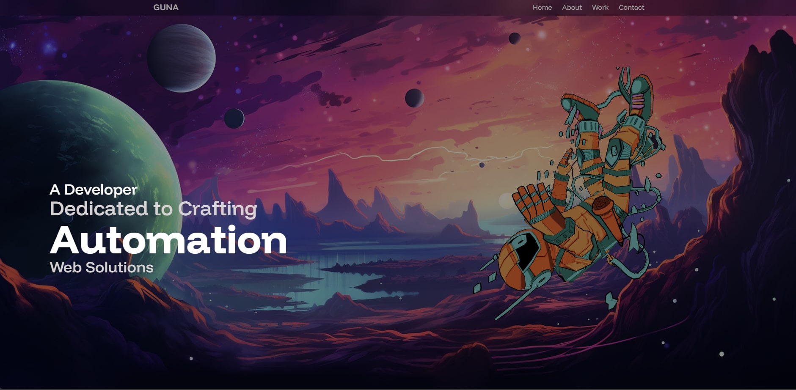

# 🚀 Guna's 3D Developer Portfolio

A modern, animated 3D developer portfolio built with React, Vite, TailwindCSS, and 3D effects — designed to showcase my skills, projects, and experience in a creative way.



---

## 📚 Table of Contents

- [Features](#-features)
- [Tech Stack](#-tech-stack)
- [Project Structure](#-project-structure)
- [Getting Started](#-getting-started)
- [Assets](#-assets)
- [Contact](#-contact)
- [Feedback](#-feedback)

---

## ✨ Features

- 3D visuals powered by **React Three Fiber**
- Smooth transitions and scroll-based animations
- Clean, responsive UI with **TailwindCSS**
- Working contact form using **EmailJS**
- Modern, mobile-friendly design
- Lightning-fast development with **Vite**

---

## 🛠 Tech Stack

| Tech              | Description                           |
|-------------------|---------------------------------------|
| React             | Front-end JavaScript library          |
| Vite              | Fast bundler and dev environment      |
| TailwindCSS       | Utility-first CSS framework           |
| React Three Fiber | 3D rendering with Three.js in React   |
| Drei              | Helpers and abstractions for R3F      |
| Framer Motion     | Animation library for React           |
| EmailJS           | Form handling and email integration   |

---

## 📁 Project Structure

```bash
├── public/
│   ├── assets/             # Images, textures, models
│   ├── models/             # 3D models
│   └── vite.svg
├── src/
│   ├── components/         # Reusable components
│   ├── constants/          # Data and config
│   ├── sections/           # Portfolio sections (Hero, About, etc.)
│   ├── App.jsx             # Main app file
│   ├── index.css           # Tailwind CSS
│   └── main.jsx            # Entry point
├── tailwind.config.js
└── vite.config.js
```

---

## 🚀 Getting Started

1. **Clone the Repository**
```bash
git clone https://github.com/Guna42/Portfolio.git
cd Portfolio
```
2. **Install Dependencies**
```bash
npm install
```
3. **Run the Development Server**
```bash
npm run dev
```
The app will be available at http://localhost:5173.

---

## 🔗 Assets
All images and assets are included in the `public/assets/` directory.

---

## 📬 Contact

- **Email:** guna.yourmail@gmail.com
- **LinkedIn:** [linkedin.com/in/your-linkedin](https://www.linkedin.com/in/your-linkedin)
- **Instagram:** [instagram.com/your-instagram](https://www.instagram.com/your-instagram)

---

## 💡 Feedback

Feel free to open an issue or reach out for suggestions, improvements, or collaboration!

---

## ⭐ Like This Project?
Star the repo to show your support!
